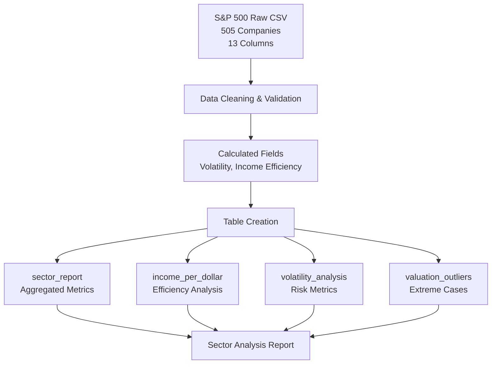
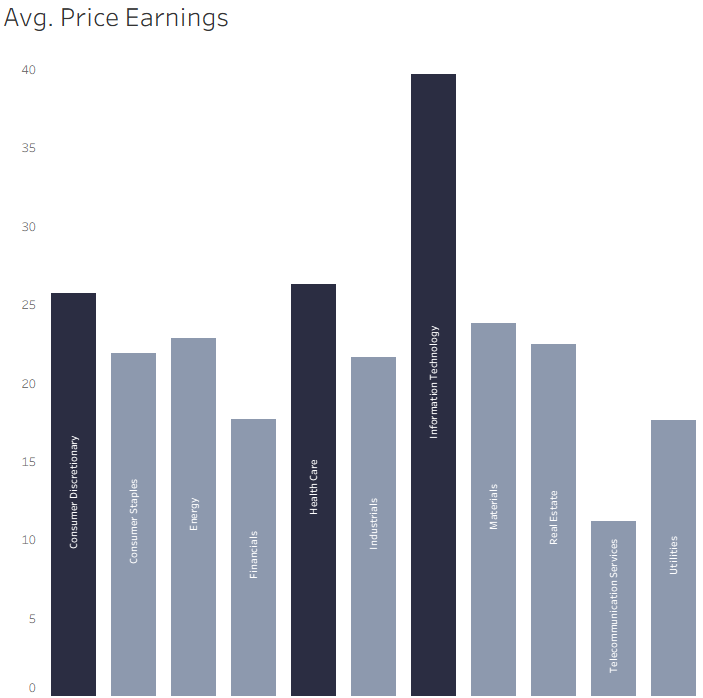
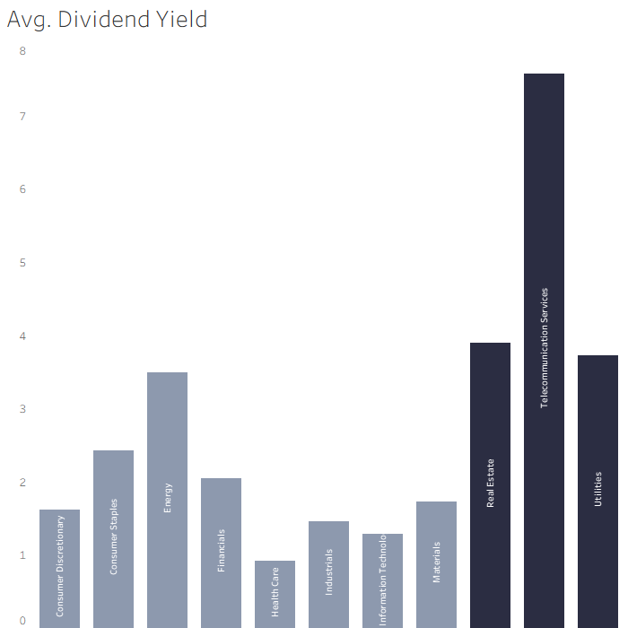
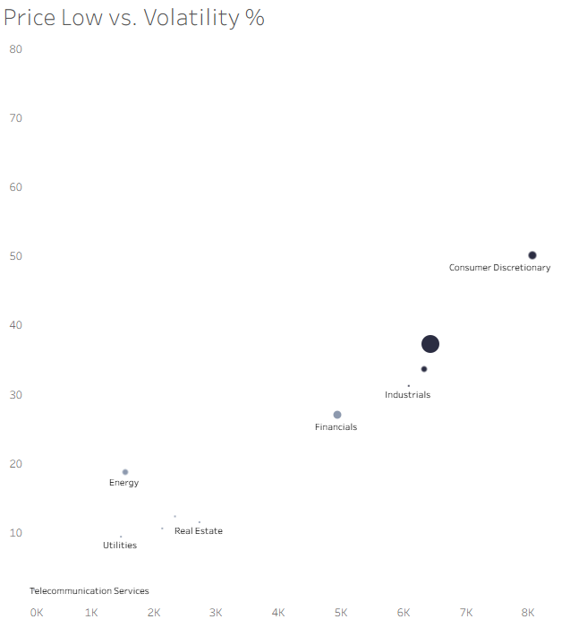
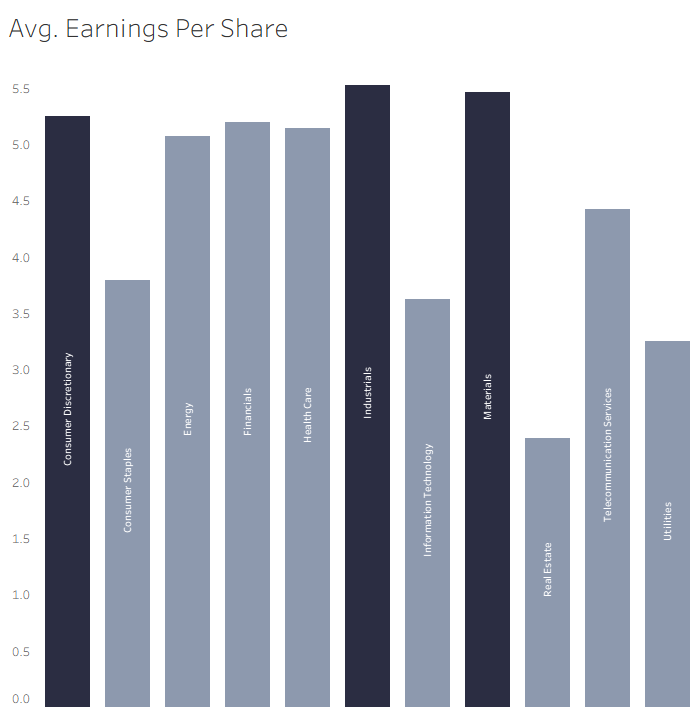
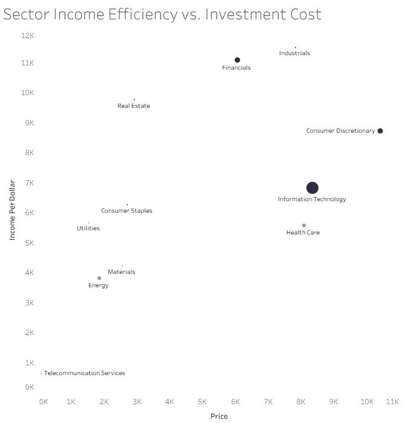

# Sector Performance Analysis Report

## Project Background

As a data analyst working within our investment management firm, I have conducted a comprehensive analysis of our current portfolio universe spanning multiple market sectors. Our firm operates as an institutional investment manager with $5.56 trillion in assets under management, having been active in equity markets for over two decades. Our business model focuses on diversified sector allocation strategies, utilizing quantitative analysis to optimize risk-adjusted returns for our institutional clients including pension funds, endowments, and sovereign wealth funds.

**Data Source:** This analysis is based on S&P 500 Companies with Financial Information dataset from Kaggle (https://www.kaggle.com/datasets/paytonfisher/sp-500-companies-with-financial-information/data). The dataset was last updated in July 2020 and provides comprehensive financial metrics across all S&P 500 constituents.

Key business metrics for our analysis include price-earnings ratios, earnings per share, dividend yields, volatility measures, and market capitalization across our investment universe. This analysis directly supports our portfolio construction and risk management processes, providing data-driven insights for sector allocation decisions.

Insights and recommendations are provided on the following key areas:

**Category 1:** Market Valuation and Growth Metrics  
**Category 2:** Income Generation and Dividend Analysis  
**Category 3:** Risk Assessment and Volatility Patterns  
**Category 4:** Capital Efficiency and Investment Optimization  

The SQL queries used to inspect and clean the data for this analysis can be found [here](#).

Targeted SQL queries regarding various business questions can be found [here](#).

An interactive Tableau dashboard used to report and explore sector trends can be found [here](#).

---

## Data Structure & Initial Checks

This analysis is based on the S&P 500 Companies with Financial Information dataset, which was processed and transformed into specialized analytical tables for comprehensive sector analysis. The data pipeline and structure is as follows:

### Source Dataset Structure
The primary CSV contains 505 S&P 500 companies with the following fields:
```
Symbol | Name | Sector | Price | Price/Earnings | Dividend Yield | 
Earnings/Share | 52 Week High | 52 Week Low | Market Cap | 
EBITDA | Price/Sales | Price/Book
```

### Derived Analytical Tables

**sector_report** - Primary analysis table with sector-level aggregations:
```sql
Sector | avg_price_earning | avg_earnings_share | avg_dividend_yield | 
eps_std_dev | company_count | max_dividend_yield | avg_price_book | 
avg_price_sales | avg_price_volatility | avg_growth_estimate | 
avg_ebitda_margin | top_dividend_stock_name | top_dividend_stock_symbol
```

**income_per_dollar** - Income efficiency analysis:
```sql
Symbol | Name | Sector | Price | Dividend_Yield | income_per_dollar
```

**volatility_analysis** - Risk assessment metrics:
```sql
Symbol | Name | Sector | low | high | volatility_pct
```

**valuation_outliers** - Extreme valuation identification:
```sql
Symbol | Name | Sector | Price | Price_Earnings | Earnings_Share
```

### Data Processing Pipeline



### Dataset Summary

| Metric | Value |
|--------|-------|
| Source Companies | 505 |
| Sectors Analyzed | 10 |
| Analytical Tables | 4 |
| Key Calculations | Volatility %, Income per Dollar, Sector Averages |
| Data Vintage | July 2020 |

---

## Executive Summary

### Overview of Findings

Our analysis of 505 companies across 10 sectors reveals significant performance disparities that create both opportunities and risks for our portfolio allocation strategy. **Information Technology commands premium valuations with an average P/E of 39.68 but shows moderate income efficiency, while Industrials and Financials demonstrate superior capital allocation with strong earnings generation at reasonable valuations.** **High-volatility sectors like Consumer Discretionary (59.28% volatility) and Information Technology (54.61% volatility) require careful position sizing, while defensive sectors like Utilities (31.53% volatility) and Real Estate (34.68% volatility) provide portfolio stability.** The telecommunications sector presents concerning metrics with the lowest P/E ratio (11.19) and minimal representation, suggesting potential structural challenges or value opportunities requiring deeper investigation.


*Dashboard Overview - Main KPI dashboard showing: Total Companies: 505, Avg P/E: 22.79, Avg Dividend Yield: 2.74%, Avg EPS: $4.47, Avg Volatility: 48.09%, Total Market Cap: $5.56T*

---

## Insights Deep Dive

### Market Valuation and Growth Metrics

**Technology Premium Valuations:** Information Technology trades at a significant premium with an average P/E ratio of 39.68, nearly 75% higher than the market average of 22.79. This reflects strong growth expectations but creates valuation risk if earnings disappoint. The sector's growth estimate of 101.16% supports the premium but requires careful monitoring.

**Telecommunications Value Anomaly:** Telecommunications presents an anomaly with the lowest P/E ratio at 11.19, potentially indicating either deep value or structural decline. With only 3 companies in our universe and a growth estimate of 54.58%, this sector warrants strategic evaluation for contrarian positioning.

**Consumer Discretionary Growth Betting:** Consumer Discretionary commands the second-highest P/E at 25.68 with the highest growth estimate at 187.77%, suggesting investors are betting heavily on economic recovery and consumer spending normalization. The 79-company representation provides good diversification within the sector.

**Financial Sector Undervaluation:** Financials trade at an attractive valuation with a P/E of 17.66, below market average, while maintaining solid earnings per share of $5.19. This suggests potential undervaluation given the sector's fundamental strength and 64-company diversification.



*Average P/E by Sector - Top 3 highlighted: Information Technology (39.68), Health Care (26.28), Consumer Discretionary (25.68)*

### Income Generation and Dividend Analysis

**Telecommunications Yield Leadership:** Telecommunications leads dividend generation with an exceptional 7.57% average yield, anchored by CenturyLink's 12.66% yield. However, the high yield may signal dividend sustainability concerns given the sector's low growth profile and minimal market representation.

**Real Estate Income Strength:** Real Estate delivers strong income with a 3.89% average yield, led by Kimco Realty at 7.71%. The sector's 33-company representation and moderate volatility (34.68%) make it attractive for income-focused allocations while providing inflation protection.

**Utilities Defensive Profile:** Utilities maintain their defensive income profile with a 3.72% yield, topped by SCANA Corp at 6.68%. The sector's low volatility (31.53%) and consistent EBITDA margins (47.11%) support dividend sustainability and capital preservation objectives.

**Energy Sector Opportunities:** Energy offers attractive income at 3.49% yield despite sector headwinds, with ONEOK leading at 5.44%. The sector's small 8-company representation concentrates risk but may provide value opportunities for selective investors.



*Average Dividend Yield by Sector - Top 3 highlighted: Telecommunication Services (7.57%), Real Estate (3.89%), Utilities (3.72%)*

### Risk Assessment and Volatility Patterns

**Consumer Discretionary Cyclical Risk:** Consumer Discretionary exhibits the highest volatility at 59.28%, reflecting sensitivity to economic cycles and consumer confidence. The sector's 79-company count provides diversification, but position sizing should account for elevated risk during market stress periods.

**Technology Sector Compound Risk:** Information Technology shows significant volatility at 54.61% despite its large market presence. The combination of high valuation (39.68 P/E) and high volatility creates compound risk that requires active management and careful entry points.

**Telecommunications Structural Uncertainty:** Telecommunications presents unusual risk characteristics with 56.32% volatility despite low growth expectations. This suggests structural uncertainty within the sector that may not be adequately reflected in its low valuation metrics.

**Defensive Sector Stability:** Utilities and Real Estate demonstrate the lowest volatilities at 31.53% and 34.68% respectively, confirming their defensive characteristics. These sectors provide portfolio anchoring during market turbulence while maintaining reasonable return potential.



*Price Low vs Volatility % scatter plot with market cap sizing - showing sector clustering patterns and risk-return relationships*

### Capital Efficiency and Investment Optimization

**Industrial Sector Excellence:** Industrials demonstrate superior earnings efficiency with $5.52 EPS, the highest among all sectors, while maintaining reasonable volatility at 45.58%. The sector's 65-company representation and strong EBITDA margins (22.28%) indicate operational excellence across the industrial base.

**Materials Capital Deployment:** Materials show strong earnings generation at $5.46 EPS with moderate volatility (41.09%), suggesting efficient capital deployment. However, the sector's limited 23-company representation concentrates exposure and requires careful security selection.

**Financial Sector Value Opportunity:** Financials generate solid earnings at $5.19 EPS while trading at attractive valuations (17.66 P/E). The sector's 64-company diversification and moderate volatility (39.90%) create an appealing risk-adjusted opportunity for value-oriented strategies.

**Consumer Discretionary Earnings Power:** Consumer Discretionary delivers strong earnings at $5.25 EPS despite high volatility, indicating underlying business strength. The sector's premium valuation appears justified by earnings power, though economic sensitivity remains a key risk factor.



*EPS by Sector - Top 3 highlighted: Industrials ($5.52), Materials ($5.46), Consumer Discretionary ($5.25)*



*Sector Income Efficiency vs Investment Cost scatter plot with market cap sizing - showing capital allocation effectiveness across sectors*

---

## Outlier Analysis & Risk Identification

Our analysis identified several companies exhibiting extreme metrics that warrant special attention for risk management and opportunity assessment:

### Income Efficiency Champions - Superior Capital Deployment

**Top Income Generators per Dollar Invested:**
- **BlackRock (BLK):** Leads all companies with exceptional $1,100.26 income per dollar invested at $509.38 share price, demonstrating superior asset management efficiency
- **Public Storage (PSA):** Real Estate leader generating $779.72 per dollar with attractive 4.32% dividend yield, showcasing REIT income optimization
- **Lockheed Martin (LMT):** Industrial efficiency champion at $775.58 per dollar with steady 2.32% yield, reflecting defense sector cash flow stability
- **Equinix (EQIX):** Real Estate/Technology hybrid delivering $770.76 per dollar, demonstrating data center infrastructure profitability
- **Simon Property Group (SPG):** Strong REIT performance at $766.99 per dollar with impressive 5.04% dividend yield

### Extreme Volatility - Maximum Risk Securities

**Highest Volatility Companies requiring enhanced risk management:**
- **Align Technology (ALGN):** Healthcare leader with extreme 210.25% volatility, trading range from $92.61 to $287.32, indicating significant operational uncertainty
- **Envision Healthcare (EVHC):** Second-highest volatility at 207.11% with range $23.77-$73.00, suggesting potential financial distress or restructuring
- **Foot Locker (FL):** Consumer Discretionary volatility leader at 173.96%, range $28.42-$77.86, reflecting retail sector challenges
- **Range Resources (RRC):** Energy sector extreme at 168.43% volatility, range $12.70-$34.09, typical of commodity price sensitivity
- **Nvidia (NVDA):** Technology volatility at 161.92%, range $95.17-$249.27, reflecting semiconductor cycle and growth expectations

### Valuation Risk Assessment - Extreme P/E Outliers

**Companies meeting high-risk valuation criteria (P/E >50 OR negative earnings with P/E >20):**

**Extreme Valuation Multiples requiring enhanced scrutiny:**
- **Salesforce.com (CRM):** Commands highest P/E at 520.15x earnings with $0.27 EPS, representing extreme growth expectations in cloud software that may be unsustainable
- **Baker Hughes (BHGE):** Energy sector distress with 305.56x P/E on negative $0.31 EPS, indicating potential financial restructuring or turnaround situation
- **Amazon (AMZN):** Consumer platform giant at 296.16x P/E with $6.16 EPS, massive growth betting at $1,350.50 share price requires careful position sizing
- **Vertex Pharmaceuticals (VRTX):** Biotech premium at 252.67x P/E with $1.04 EPS, likely reflecting pipeline value and specialty drug margins
- **EOG Resources (EOG):** Energy sector stress at 246.44x P/E on negative $1.98 EPS, indicating commodity cycle challenges

**Moderate High-Risk Valuations:**
- **Netflix (NFLX):** Streaming leader at 200.08x P/E with $1.25 EPS, growth story premium requiring competitive positioning monitoring
- **SBA Communications (SBAC):** Infrastructure REIT at 199.81x P/E with $0.62 EPS, tower asset valuations may be stretched
- **Occidental Petroleum (OXY):** Oil major at 195.63x P/E on negative $0.75 EPS, energy sector restructuring candidate

These securities require enhanced due diligence, strict position limits, and frequent fundamental review due to extreme valuation metrics that create significant downside risk if growth expectations are not met or earnings fail to recover.


*Outlier Analysis Dashboard showing top income efficiency performers, extreme volatility securities, and valuation risk categories with specific company examples*

---

## Recommendations

Based on the insights and findings above, we would recommend the **Portfolio Management Team** to consider the following:

**Overweight Industrials and Financials:** Both sectors demonstrate superior fundamental metrics with attractive valuations. Industrials lead in earnings generation while Financials trade below market multiples, creating compelling risk-adjusted opportunities for core portfolio positions.

**Reduce Information Technology exposure:** The sector's 39.68 P/E ratio combined with 54.61% volatility creates unfavorable risk-return dynamics. Consider tactical reduction during market strength while maintaining exposure to highest-conviction technology names.

**Strategic evaluation of Telecommunications:** The sector's extreme characteristics (highest yield, lowest P/E, high volatility) require deeper fundamental analysis. Consider small contrarian position if dividend sustainability can be confirmed, or avoid entirely if structural decline is evident.

**Maintain defensive allocation to Utilities and Real Estate:** Both sectors provide portfolio stability with reasonable income generation. Their low volatility profiles support risk management objectives while offering inflation protection through Real Estate exposure.

**Selective Energy exposure:** The sector's attractive dividend yield and potential cyclical recovery merit consideration, but the 8-company limitation requires individual security analysis rather than broad sector allocation.

**Enhanced outlier monitoring:** Implement systematic tracking of extreme valuation metrics (P/E >40x) and volatility outliers (>100% volatility) like AbbVie and high-multiple technology names. These securities require enhanced position limits and frequent rebalancing protocols.

---

## Assumptions and Caveats

Throughout the analysis, several key assumptions were made to manage data challenges and analytical limitations:

**Data Currency Limitations:** This analysis is based on S&P 500 financial data as of July 2020. Market conditions, company fundamentals, and sector dynamics may have changed significantly since the dataset's last update, particularly given major economic events and market shifts in 2020-2025.

**Market Valuation Assumptions:** Market capitalization data reflects reporting date values and may not capture current market pricing due to subsequent price movements and market volatility.

**Dividend Sustainability:** Dividend yield calculations assume continuation of current payment policies. Dividend cuts or suspensions could materially impact sector attractiveness, particularly affecting high-yield sectors like Telecommunications.

**Volatility Predictiveness:** Historical volatility calculations may not predict future risk levels, especially during periods of structural market change or unprecedented economic conditions.

**Sector Classification:** Companies follow standard GICS methodology, though diversified business models may not perfectly align with assigned sector characteristics.

**Growth Estimate Reliability:** Growth projections represent consensus analyst forecasts subject to significant revision based on changing economic conditions or company-specific developments.

**Outlier Treatment:** Companies with extreme P/E ratios (>50x) or zero income generation were included in sector averages but flagged separately, as these may skew sector-level conclusions and require individual rather than sector-based analysis.

---

## Data Attribution

**Dataset Source:** S&P 500 Companies with Financial Information  
**Provider:** Kaggle (Payton Fisher)  
**URL:** https://www.kaggle.com/datasets/paytonfisher/sp-500-companies-with-financial-information/data  
**Last Updated:** July 2020  
**License:** Dataset used under Kaggle's terms of service for educational and analytical purposes
